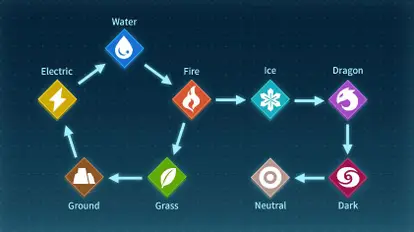

# Sistema especilista em Pals de Palworld

## INSTALAR

```sh
sudo apt-add-repository ppa:swi-prolog/stable
sudo apt-get update
sudo apt-get install swi-prolog
```

## RODAR

```sh
swipl -s palworld.pl
```

## COMO USAR

### Iniciar o especialista em Pal

```sh
iniciar_especialista.
```

### Pesquisas

**OBS: o jogo e a base de dados esta em desenvolvimento entao os resultados apresentados na documentacao podem ser diferentes dos reais mas o formato do retorno nao.**

-   Buscar pelo nome:

    ```sh
    ?- pal_por_nome(cattiva).
    ```

    retorno:

    ```sh
    --- Dados de cattiva ---
    Número: 2
    Tipos: [normal]
    Habilidade: cat_helper
    Trabalhos: [gathering,handiwork,mining,transporting]
    Drops: [red_berries]
    Vida: 70
    Ataque: 70
    Defesa: 70
    Montaria: nao_montaria
    ```

-   Buscar pelo numero:

    ```sh
    ?- pal_por_numero(7).
    ```

    retorno:

    ```sh
    --- Dados do Pal número 7 ---
    Nome: sparkit
    Tipos: [electricity]
    Habilidade: static_electricity
    Trabalhos: [generating_electricity,handiwork,transporting]
    Drops: [electric_organ]
    Vida: 60
    Ataque: 70
    Defesa: 75
    Montaria: nao_montaria
    ```

-   Buscar pelo trabalho:

    ```sh
    ?- pals_com_trabalho(generating_electricity).
    ```

    retorno:

    ```sh
    Pals com o trabalho generating_electricity: [sparkit,jolthog]
    ```

-   Buscar pelo drop:

    ```sh
    ?- pals_com_drop(wool).
    ```

    retorno:

    ```sh
    Pals que dropam wool: [lamball,cremis]
    ```

# Documentação do Jogador

## O que é palword?

Palworld é um jogo de sobrevivência de ação e aventura do desenvolvedor japonês Pocket Pair. O jogo se passa em um mundo aberto povoado por criaturas semelhantes a animais conhecidas como "Pals". Os jogadores podem lutar e capturar amigos para usá-los na construção de bases, travessia e combate.

## Como jogar prolog_palword?

Após executar o código prolog em alguma IDE (acima na primeira sessão é ensinado a como fazer isso utilizando o vscode em um linux ubuntu 22.04), para dar inicío utilize o comando:

```sh
iniciar_especialista.
```

Os pals serão escolhidos de acordo com perguntas que irão testar as caracteristicas do pal escolhido

### O que são características?
Cada pal contém um conjunto de características que definem como eles são, para o que são bons, e alguns atributos seus, a exemplo vamos usar o seguinte pal para demonstrar suas características:
**pal(025, celaray, [water], zephyr_glider, [transporting, watering], [pal_fluids], 80, 100, 80, nao_montaria).**
- ID (025) é um identificador da espécie do pal, em geral é único porém existem excessões quando a mesma espécie tem duas variações (ex: mau e mau_crystal)
- Nome (celaray) é o nome atribuido a esta espécie
- Tipo ([water]) é o tipo elemental do seu pal, tipos podem definir o quão efetivo e não-efetivo seus ataques são contra outros tipos de pals, aqui vai uma imagem para melhor ilustrar, onde as setas começam em quem é efetivo contra o tipo na seta 

- Habilidade (zephyr_glider) é a habilidade passiva que este pal apresenta, elas apresentam alguns buffs
- Trabalho ([transporting, watering]) diz em quais trabalhos esse pal é especialmente melhor que a média
- Loot/Drop ([pal_fluid]) diz quais são os possíveis items que este pal deixa ao ser derrotado
- Vida (80) é o status vida do pal em sua forma base (sem nenhum buff externo)
- Ataque (100) é o status ataque do pal em sua forma base (sem nenhum buff externo)
- Defesa (80) é o status defesa do pal em sua forma base (sem nenhum buff externo)
- Montavel (nao_montaria) diz se este pal pode ser utilizado como montaria

### Continuando com a execução do jogo
E logo será dado a ordem das perguntas que serão feitas, sendo cada pergunta tendo 3 possíveis respostas que darão um peso a esta caracteristica:

1. sim. -> irá influenciar positivamente na escolha do seu pal
2. nao. -> irá influenciar negativamente na escolha do seu pal
3. nao_sei. -> não irá influenciar na escolha do seu pal

As perguntas sendo respondidas serão utilizadas para filtragem e então escolha final do seu pal, exemplo de pergunta:
```
O Pal possui o tipo dark? (sim/nao/nao_sei): |:
```

### Dados obtidos
Ao todo foram digitalizados na database 122 pals, não sendo o número total de pals existentes no jogo porém já é um número julgado adequado para a demonstração deste jogo

# Link do vídeo tutorial no YT <https://youtu.be/OUAADkNgAVU>